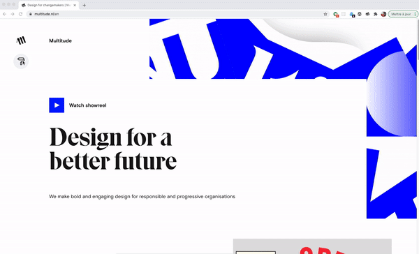
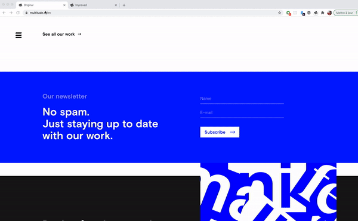

# Multitude Agency project

The objective of this project is to improve the [English Front Page](https://www.multitude.nl/en) of the Multitude Agency by:

1. Providing a button to switch color theme.
2. Improving the accessibility on the newsletter form.

On the technical side, I used a Chrome extension to insert the HTML, CSS and JS when the page loads.

## Demo Theme Switcher:



## Demo Improved Accessibility:



## Features:

-  Switch automatically to dark color theme if its the user OS preferences.
-  3 different themes available (Classic, Dark, Climate).
-  improved accessibility in the newsletter form

## Dev stack

-  JavaScript
-  CSS

## Project Structure

```sh
.
├── demo/                         # This folder contains all the demo files.
│   └── demo_accessibility.mov    # Quick accessability demo in Mov format.
│   └── demo_accessibility.gif    # Quick accessability demo in GIF format.
│   └── demo_theme_switcher.mov   # Quick theme switcher demo in Mov format.
│   └── demo_theme_switcher.gif   # Quick theme switcher demo in GIF format.
├── icon/                         # The icons which are displayed in the Chrome's toolbar.
│   └── favicon-16x16.png         # 16*16 icon.
│   └── favicon-32x32.png         # 32*32 icon.
├── content.js                    # Javascript which is injected to the page by the extension
├── manifest.json                 # Config file that configure the rights and permissions for this extension
├── README.md                     # This file
└── styles.css                    # CSS which is injected to the page by the extension (and override the existing styles)
```

## Usage:

Install this Chrome extension manually:

1. Download the content of this folder on Github
2. Then type in your URL: chrome://extensions/
3. Drag and drop the folder there and activate the extension.
4. Go to [multitude.nl/en](https://www.multitude.nl/en), you should now be able to see a theme switcher.

## Inspiration and resources:

-  https://www.multitude.nl/en/work/2-degrees-investing-initiative
-  https://humanebydesign.com/principles/inclusive
-  https://a11y.coffee/quick-wins/
-  https://css-tricks.com/a-complete-guide-to-dark-mode-on-the-web/
-  https://mxb.dev/blog/color-theme-switcher/
-  https://medium.com/pulsar/which-accessibility-testing-tool-should-you-use-e5990e6ef0a
